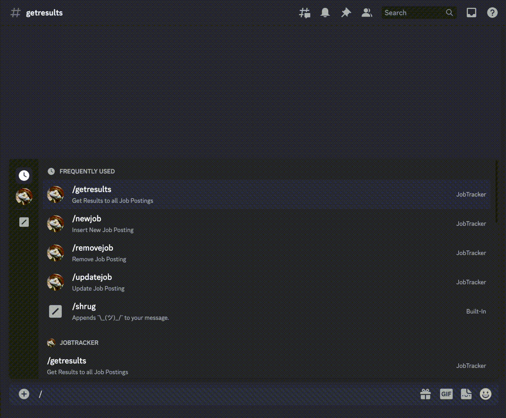

# Description
This discord bot enables users to keep track of their job applications as opposed to to using ordinary job tracker websites or plainly writing down their results. Through a series of commands a user is able to add/create job applications to their account, then they have the chance to update the status of the job application with the options of 'waiting', 'rejected', and 'accepted'. Another command called /getresults also shows the total amount of jobs a user has applied for along with the sub-categories of results. A newly implemented feature is /generatecoverletter, using the openai API users are able to plug in their resumes and a cover letter in which a custom cover letter will be generated for you.

# Link to Use Yourself
<a href='https://discord.com/api/oauth2/authorize?client_id=1106759915466403870&permissions=26829587381312&scope=bot' target="_blank">Invite</a>

# Commands to Use
## /newJob 

## /getResults

## /updateJob

## /removeJob
